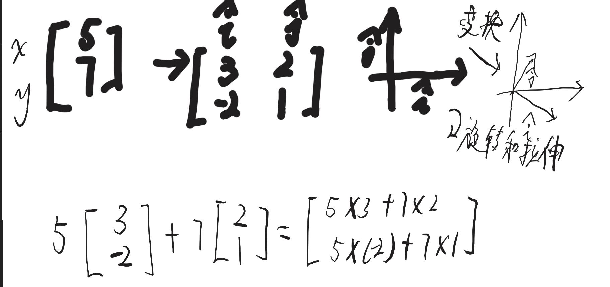

# 前置补充

## 什么是集合

多个能够确认且唯一的元素组成的群体

## 什么是有序对

a作为第一个元素，b作为第二个元素，按这个顺序排列下去的二元数组

## 什么是映射

两个集合存在某种关系，且集合元素也符合这种关系，A的元素a有且B中的一个元素b对应（可以多对一）

## 什么是对数函数

未知数在指数位置上，即存在log

## 什么是配方法

一次项前的常数除以2放进括号中，外面减去除以二后的平方

## 一些关于向量的知识

```math
\begin{bmatrix}1 \\ 2 \end{bmatrix}
```

这样有数字组成的向量，将数字看作标量
x轴上的单位向量 $\hat{i}$
y轴上的单位向量 $\hat{j}$
称为基向量，可以看作基向量的变换

```math
\begin{bmatrix}1 \\ 2 \end{bmatrix} = (1)\hat{i}+(2)\hat{j}
```

基向量可以重定义

## 什么是线性组合

$a\vec{v}+b\vec{w}$

## 什么是张成空间

线性组合的所有可能组合的集合

## 什么是线性变换

接收一个向量变成另一个输出向量

每个向量的变换是均匀的，且原点不变

原本 $ \begin{bmatrix}1 \\ 2 \end{bmatrix}$是由 $ (1)\hat{i}+(2)\hat{j}$组成，那么变换后，依然是由他们组成



确认原本的基向量 $ \hat i和\hat j$，根据他们的变换后的落点组成2*2矩阵，拿输入向量乘这个矩阵，得到输出向量

## 什么是线性方程

```math
2x+5y+3z=-3\\
4x+0y+8z=0\\
1x+3y+0z=2
```

变换

$A\vec x=\vec v $

```math
\begin{bmatrix} 2 & 5 & 3 \\ 4 & 0 & 8 \\ 1 & 3 & 0 \end{bmatrix}
\begin{bmatrix} x \\ y \\ z \end{bmatrix}
=
\begin{bmatrix} -3 \\ 0 \\ 2 \end{bmatrix}
```

向量x经过A的变换，称为向量v
$A^{-1}是A的逆变换$
$ \vec x = A^{-1} \vec v$