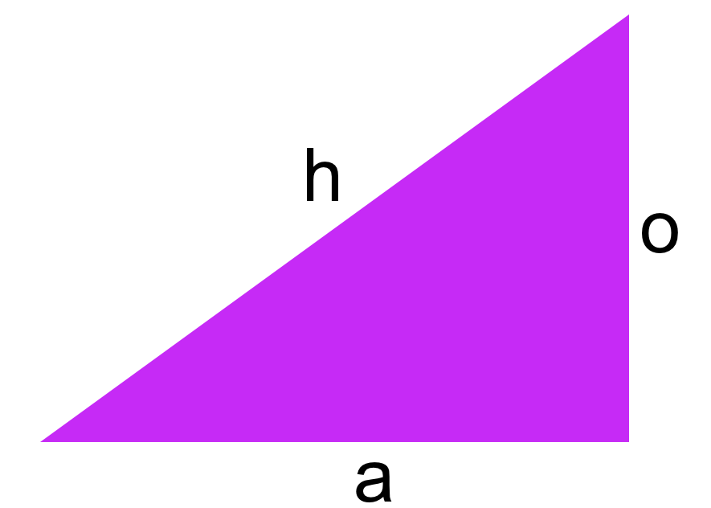
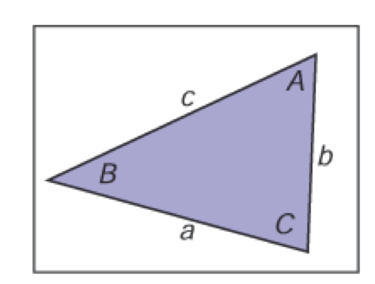

# 常用公式合集(方便速查)

## 解二次方程

$x=\frac{-B\pm \sqrt{B^2-2AC}}{2A}$

## 对数运算

$a^{log_a(x)}=x$

$log_a(a^x)=x$

$log_a(xy)=log_ax+log_ay$

$log_a(x/y)=log_ax-log_ay$

$log_ax=log_ab\cdot log_bx$

## 自然对数

$\frac{d}{dx}log_ax=\frac{1}{xlna}$

$\frac{d}{dx}a^x=a^xlna$

## 角度与弧度转换

$角度=弧度\times \frac{180^\circ}{\pi}$

$弧度=角度\times \frac{\pi}{180^\circ}$

## 三角

$正弦 \sin \theta = \frac{o}{h}$

$余弦 \cos \theta = \frac{a}{h}$

$正切 \tan \theta = \frac{o}{a}$

### 平移恒等式

$\sin(-A)=-\sin A$

$\cos(-A)=\cos A$

$\tan(-A)=-\tan A$

$\sin(\frac{\pi}{2}-A)=\cos A$

$\cos(\frac{\pi}{2}-A)=\sin A$

$\tan(\frac{\pi}{2}-A)=\cot A$

### 勾股恒等式

$\sin^2A+cos^2A=1$

$\sec^2A-\tan^2A=1$

$\csc^2A-\cot^2A=1$

### 加减恒等式

$\sin(A+B)=\sin A \cos B+\sin B \cos A$

$\sin(A-B)=\sin A \cos B-\sin B \cos A$

$\sin(2A)=2\sin A \cos A$

$\cos(A+B)=\cos A \cos B- \sin A \sin B$

$\cos(A-B)=\cos A \cos B +\sin A \sin B$

$\cos(2A)=\cos^2A-sin^2A$

$\tan(A+B)=\frac{\tan A+\tan B}{1-\tan A \tan B}$

$\tan (A-B)=\frac{\tan A-\tan B}{1+\tan A \tan B}$

$\tan(2A)=\frac{2\tan A}{1-tan^2A}$

### 半角恒等式

$\sin^2(\frac{A}{2})=\frac{(1-\cos A)}{2}$

$cos^2(\frac{A}{2})=\frac{(1+\cos A)}{2}$

### 乘积恒等式

$\sin A \sin B=\frac{-(\cos (A+B)-\cos(A-B))}{2}$

$\sin A \cos B=\frac{(\sin(A+B)+\sin(A-B))}{2}$

$\cos A \cos B=\frac{(\cos(A+B)+\cos(A-B))}{2}$

### 任意三角恒等式

$\frac{\sin A}{a}=\frac{\sin B}{b}=\frac{\sin C}{c}$

$c^2=a^2+b^2-2ab\cos C$

$\frac{a+b}{a-b}=\frac{\tan(\frac{A+B}{2})}{\tan(\frac{A-B}{2})}$

$三角面积=\frac{1}{4}\sqrt{(a+b+c)(-a+b+c)(a-b+c)(a+b-c)}$

## 向量

$\vec{v}+\vec{w}=\begin{bmatrix}v_1\\ v_2\end{bmatrix}+\begin{bmatrix}w_1\\ w_2\end{bmatrix}=\begin{bmatrix}v_1 + w_1\\ v_2 + w_2 \end{bmatrix}$

数字n被称为标量
$n\vec{v}=\begin{bmatrix}n\cdot v_1\\ n \cdot v_2\end{bmatrix}$